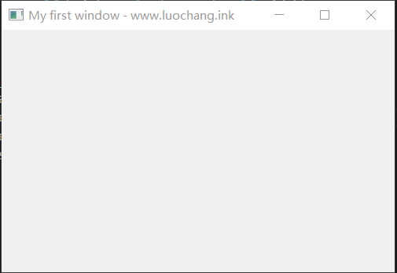
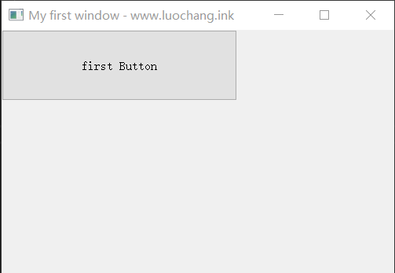
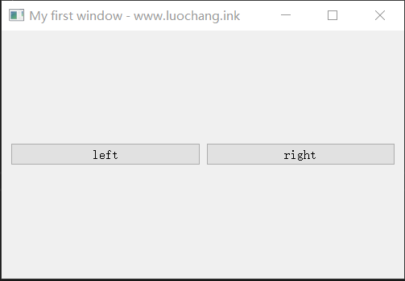
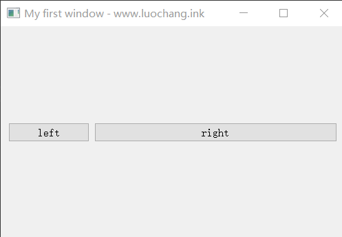
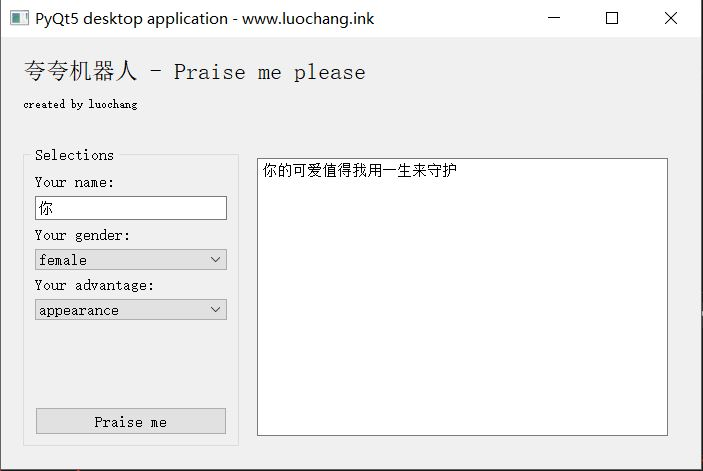

> PyQt5是Python环境下用来开发UI界面的一个包。它容易上手，对初学者友好，并且拥有丰富的函数库，可以实现大部分桌面应用的开发需求，且支持QSS语言，能够对界面风格做个性化调整。总体来说，PyQt5是一款开发效率极高的UI框架。这篇文章从零开始，教你搭建一个属于自己的桌面应用。

【GitHub项目地址】：https://github.com/luochang212/PyQt5_Demo

### 创建第一个窗口

一般来说，桌面应用都以窗口(window)形式呈现。因此，要搭建桌面应用，首先要创建窗口。

下面这段代码创建了一个空的窗口。

```python
from PyQt5.QtWidgets import *
import sys


class Window(QMainWindow):
    def __init__(self):
        super().__init__()

        # set the title of main window
        self.setWindowTitle('My first window - www.luochang.ink')

        # set the size of window
        self.Width = 500
        self.height = int(0.618 * self.Width)
        self.resize(self.Width, self.height)


if __name__ == '__main__':
    app = QApplication(sys.argv)
    ex = Window()
    ex.show()
    sys.exit(app.exec_())

```



这段代码仅仅设置了窗口的标题和大小。下一步，我们要往这个空的窗口里添加部件(widget). 为了规范性，我们在Window类里新建一个函数initUI, 然后在initUI里为窗口添加部件。

### 为窗口添加部件

下面这段代码为窗口添加了一个按钮(QPushButton).

```python
from PyQt5.QtWidgets import *
import sys


class Window(QMainWindow):
    def __init__(self):
        super().__init__()

        # set the title of main window
        self.setWindowTitle('My first window - www.luochang.ink')

        # set the size of window
        self.Width = 500
        self.height = int(0.618 * self.Width)
        self.resize(self.Width, self.height)

        self.initUI()

    def initUI(self):

        # create a new button
        self.btn = QPushButton('first Button', self)
        self.btn.resize(300,90)


if __name__ == '__main__':
    app = QApplication(sys.argv)
    ex = Window()
    ex.show()
    sys.exit(app.exec_())

```


但是我们发现，如果没有添加任何布局，我们创建的按钮(self.btn), 永远被放置在窗口的左上角。即使我们可以用move函数移动它，排版作用也非常有限。因此我们需要为窗口添加布局。

### 为窗口添加布局

PyQt5的布局(layout)有很多，比较常见的有QBoxLayout, QGridLayout, QFormLayout. 但我要说，后两种布局都有其局限性，一般只适用于特殊场景，但QBoxLayout却是一招打遍天下无敌手。大部分情况下，QBoxLayout都可以替代其他两种布局方式。

QBoxLayout的布局思想是：通过定义部件之间的上下左右关系来定义空间结构。因此它有两个函数QHBoxLayout和QVBoxLayout, 函数名里的H和V分别对应英文单词horizontal和vertical, 代表水平和竖直。所以，QHBoxLayout代表横向排版，QVBoxLayout表示纵向排版。

下面这段代码是一个QHBoxLayout的例子。为了简洁，重复的代码就不放了，这里只贴initUI的部分。

```python
def initUI(self):
        
        # create new buttons
        self.btn_left = QPushButton('left', self)
        self.btn_right = QPushButton('right', self)

        # setting up a layout
        main_layout = QHBoxLayout()
        main_layout.addWidget(self.btn_left)
        main_layout.addWidget(self.btn_right)

        # create the central widget
        main_widget = QWidget()
        main_widget.setLayout(main_layout)
        self.setCentralWidget(main_widget)

```



可以看出，创建一个布局只需要三步。

* 创建部件(widget).
* 创建布局(layout), 并将部件依次添加到布局中。
* 创建中心部件(central widget), 并为中心部件添加布局。

要理解这三步，首先要理解什么是中心部件(central widget)。中心部件和按钮部件(QPushButton)虽然都被称作部件(widget), 但它俩是完全不同的。与按钮部件相比，中心部件没有固定的功能和形态，它就像画布，本身是空白的，因此你无法直接在窗口中看到它。它的作用在于通过调整它的布局属性(setLayout)来对其他部件排版。

中心部件，布局和部件之间的逻辑关系如下。

<html>
<center> main_widget（中心部件）
<br> |
<br> &nbsp&nbsp&nbsp&nbsp&nbsp&nbsp&nbsp&nbsp&nbsp&nbsp&nbsp&nbsp&nbsp&nbsp&nbsp&nbsp | setLayout
<br> ↓
<br> main_layout（布局）
<br> |
<br> &nbsp&nbsp&nbsp&nbsp&nbsp&nbsp&nbsp&nbsp&nbsp&nbsp&nbsp&nbsp&nbsp&nbsp&nbsp&nbsp&nbsp&nbsp | addWidget
<br> ↓
<br> btn_left & btn_right （部件）
</center>
</html>

### 布局进阶之部件缩放

布局定义了部件之间的位置关系，但有了布局还不够，我们还需要定义部件之间的比例关系。这需要用到setStretch函数。

下面这段代码调整两个按钮之间的比例为1:3。

```python
def initUI(self):
        
        # create a new button
        self.btn_left = QPushButton('left', self)
        self.btn_right = QPushButton('right', self)

        # setting up a layout
        main_layout = QHBoxLayout()
        main_layout.addWidget(self.btn_left)
        main_layout.addWidget(self.btn_right)

        # set stretch for main layout
        main_layout.setStretch(0, 1)
        main_layout.setStretch(1, 3)

        # create the central widget
        main_widget = QWidget()
        main_widget.setLayout(main_layout)
        self.setCentralWidget(main_widget)

```



上述代码只在原基础上加了两行。

* `main_layout.setStretch(0, 1)`表示0号部件的拉伸设置为1

* `main_layout.setStretch(1, 3)`表示1号部件的拉伸设置为3

由此，两个部件之间的比例关系被定义为1：3。

### 布局进阶之部件迭代

在PyQt5里，类似中心部件这样的用于布局的部件可以多次迭代。这意味着你可以往布局部件里的布局部件里加布局部件。

下面这段代码阐明了这种迭代结构。

```python
# 创建孙子部件
sub_sub_Layout = QHBoxLayout()
sub_sub_widget = QWidget()
sub_sub_widget.setLayout(sub_sub_Layout)

# 创建儿子部件
sub_Layout = QHBoxLayout()
sub_Layout.addWidget(sub_sub_widget)  # 儿子认孙子
sub_widget = QWidget()
sub_widget.setLayout(sub_Layout)

# 创建父亲部件
main_layout = QHBoxLayout()
main_layout.addWidget(sub_widget)  # 父亲认儿子
main_widget = QWidget()
main_widget.setLayout(main_layout)
self.setCentralWidget(main_widget)

```

### 制作一个布局灵活的UI界面

学会了以上这些方法，再配合一些奇技淫巧，比如加空白的占位部件addStretch(int), 你基本上就可以随心所欲地控制布局了。 

下面这段代码制作了一个有意思的桌面应用：夸夸机器人。

```python
from PyQt5.QtWidgets import *
from PyQt5.QtGui import *
import sys, random


class Window(QMainWindow):
    def __init__(self):
        super().__init__()
        # set the title of main window
        self.setWindowTitle('PyQt5 desktop application - www.luochang.ink')

        # set the size of window
        self.Width = 700
        self.height = int(0.618 * self.Width)
        self.resize(self.Width, self.height)

        # create all widgets
        self.Label1 = QLabel("夸夸机器人 - Praise me please")
        self.Label1.setFont(QFont('bold', 14))

        self.Label2 = QLabel("created by luochang")
        self.Label2.setFont(QFont('bold', 7))

        self.nameBox = QLineEdit('你')

        self.genderBox = QComboBox()
        self.genderBox.addItem('all')
        self.genderBox.addItem('female')
        self.genderBox.addItem('male')
        
        self.advantageBox = QComboBox()
        self.advantageBox.addItem('all')
        self.advantageBox.addItem('character')
        self.advantageBox.addItem('intelligence')
        self.advantageBox.addItem('appearance')

        self.textBox = QTextEdit(self)

        self.btn = QPushButton('Praise me', self)
        self.btn.clicked.connect(self.praise_me)

        self.initUI()

    def initUI(self):
        # setting up layout of main window
        upper_widget = self.create_upper_widget()
        lower_widget = self.create_lower_widget()
        
        main_layout = QVBoxLayout()
        main_layout.addWidget(upper_widget)
        main_layout.addWidget(lower_widget)
        main_layout.setStretch(0, 1)
        main_layout.setStretch(1, 4)
        main_widget = QWidget()
        main_widget.setLayout(main_layout)
        self.setCentralWidget(main_widget)

    def create_upper_widget(self):
        upper_layout = QVBoxLayout()
        upper_layout.addWidget(self.Label1)
        upper_layout.addStretch(5)
        upper_layout.addWidget(self.Label2)
        upper_layout.addStretch(5)
        upper_widget = QWidget()
        upper_widget.setLayout(upper_layout)
        return upper_widget

    def create_lower_widget(self):
        lower_left_widget = QGroupBox("Selections")
        lower_left_layout = QVBoxLayout()        
        lower_left_layout.addWidget(QLabel("Your name:"))
        lower_left_layout.addWidget(self.nameBox)
        lower_left_layout.addWidget(QLabel("Your gender:"))
        lower_left_layout.addWidget(self.genderBox)
        lower_left_layout.addWidget(QLabel("Your advantage:"))
        lower_left_layout.addWidget(self.advantageBox)
        lower_left_layout.addStretch(5)
        lower_left_layout.addWidget(self.btn)
        lower_left_widget.setLayout(lower_left_layout)
        
        lower_right_layout = QVBoxLayout()
        lower_right_layout.addWidget(self.textBox)
        lower_right_widget = QWidget()
        lower_right_widget.setLayout(lower_right_layout)

        lower_layout = QHBoxLayout()
        lower_layout.addWidget(lower_left_widget)
        lower_layout.addWidget(lower_right_widget)
        lower_layout.setStretch(0,1)
        lower_layout.setStretch(1,2)
        lower_widget = QWidget()
        lower_widget.setLayout(lower_layout)
        return lower_widget

    def praise_me(self):
        name = str(self.nameBox.text())
        gender = str(self.genderBox.currentText())
        advantage = str(self.advantageBox.currentText())

        sentence = [['怎么可以这么好！', '是要萌死我吗？', '举止端方，温文尔雅', '知书达理', '言谈可亲', '是我的小天使',\
                    '豁达开朗', '温柔体贴善解人意', '非常绅士', '为人大方，乐于助人', '重情重义', '是个值得信任的男人'], 
                    ['博闻强记', '才高八斗', '饱读诗书', '秀外慧中', '真是个小机灵鬼', '明明可以靠脸吃饭，非要靠才华',\
                    '品学兼优', '学富五车', '上知天文下知地理','是诸葛亮转世', '有颜又有才', '可以说是“上得厅堂，下得厨房”'],
                    ['好苗条哦！我好酸', '是我的梦中女神', '美丽大方', '刚一出来我还以为是刘亦菲', '好可爱，像洋娃娃', '的可爱值得我用一生来守护',\
                    '好帅！！我想给你生猴子', '可太帅了，我能爱一辈子', '帅气又迷人', '是酷酷男孩！', '有着大海般深邃的眼睛', '是个帅小伙']]

        if gender == 'all':
            column_start = 0
            column_stop = len(sentence[0])
        elif gender == 'female':
            column_start = 0
            column_stop = int(len(sentence[0])/2)
        elif gender == 'male':
            column_start = int(len(sentence[0])/2)
            column_stop = len(sentence[0])
        else:
            print('genderBox error')

        if advantage == 'all':
            row = random.randrange(0, len(sentence))
        elif advantage == 'character':
            row = 0
        elif advantage == 'intelligence':
            row = 1
        elif advantage == 'appearance':
            row = 2
        else:
            print('advantageBox error')

        praise_sentence = sentence[row][random.randrange(column_start, column_stop)]

        self.textBox.setText("{}{}".format(name, praise_sentence))


if __name__ == '__main__':
    app = QApplication(sys.argv)
    ex = Window()
    ex.show()
    sys.exit(app.exec_())

```

这是我做的夸夸机器人，给它取的英文名叫praise me please. 输入姓名、性别和你要它夸你啥，然后点praise me, 他就会开始随机夸你。哈哈哈我觉得好智障啊，但我喜欢！


